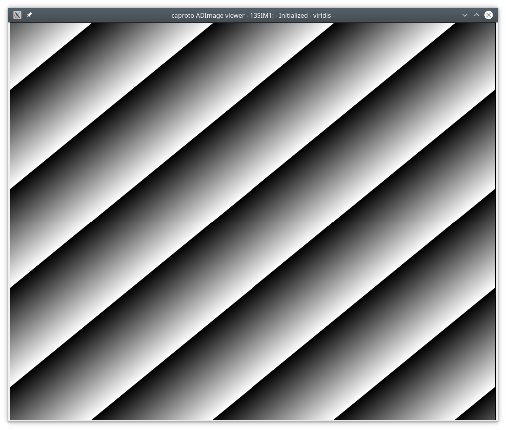

caproto-image-viewer
====================

**DEPRECATED** and unsupported. OpenGL support is broken on the latest numpy,
and the basic image viewer does not have many features.

caproto/PyQt5-based EPICS AreaDetector image viewer with OpenGL/GLSL color
mapping

Provides two widgets with varying support for image types (see next section):

    1. ImageViewerWidgetGL
        a. Requires OpenGL 4.1-compatible hardware
        b. Optional color-mapping (using look-up tables from matplotlib)
        c. Bayer demosaic is done fully on the GPU
    2. ImageViewerWidget 
        a. Raw image display - OpenGL not required
        b. No color mapping yet
        c. Limited image format support (on the TODO list)


Supported Image Formats
=======================

| Format        | ImageViewerWidget  | ImageViewerWidgetGL |
|:-------------:|:------------------:|:-------------------:|
| Monochrome    |       Yes          |         Yes         |
| RGB1          |       Yes          |         Yes         |
| RGB2          |       Yes          |         Yes         |
| RGB3          |       Yes          |         Yes         |
| Bayer - RGGB  |                    |         Yes         |
| Bayer - GBRG  |                    |         Yes         |
| Bayer - GRBG  |                    |         Yes         |
| Bayer - BGGR  |                    |         Yes         |
| YUV444        |                    |                     |
| YUV422        |                    |                     |
| YUV421        |                    |                     |


Notes:
* RGB2 is much slower than RGB1, RGB3. This can be improved at some point.


Requirements
============

* Python 3.6+
* caproto or pyepics
* PyQt5
* numpy


Optional
========

* Matplotlib (only for additional color maps)


Installation
============

```bash
$ pip install -e .
```

Usage
=====

If you have the ADSimDetector example IOC running, run the following for the
OpenGL viewer:
```bash
$ caproto-image-viewer 13SIM1: --acquire --gl
```

Note that the `--acquire` part starts acquisition of the detector, and this may
not be necessary or desirable if you use it with an existing camera/detector.



Then press the `spacebar` to enable color-mapping:


Cycle through the colormaps by pressing either `[` or `]`. Or, press `p` to
preview other colormaps in realtime - while still acquiring:


You can cycle through this list similarly with `[` and `]`, and exit the
preview with `p`.

Alternatively, use the basic non-OpenGL version:
```bash
$ caproto-image-viewer 13SIM1: --acquire
```

Speed
=====

The OpenGL display widget is very fast. Basic testing has shown:

* Minimal IOC-to-screen latency
* Displays 200Hz, 1MP 8-bit images with real-time color-mapping
* Utilizes ~40% of one core in a 4-core system

Though the viewer is capable of doing this with ease, you probably shouldn't
saturate your network viewing things at such a high frame rate unnecessarily.
That's up to you, of course!


